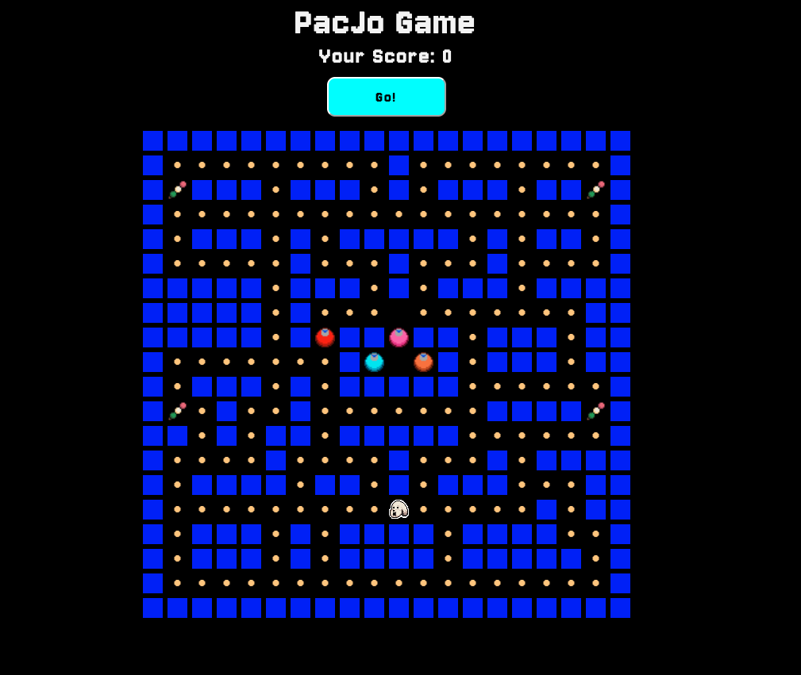

# Description

I have remade a browser based version of the old arcade game PacMan. In my game, you play as a small white dog, trying to collect all food pellets while being chased by four relentless roombas. The dog can temporarily disable the enemies by collecting a special item - his favourite squeaky toy. The game ends when all pellets and toys are collected by the dog or when the dog is caught by a roomba. 

Disclaimer - I first made a fully working PacMan game and only then I changed the styling to include dog elements. Therefore all the code in my code snippets will be referring to Pacman = the player, Ghosts = Roombas, Special Pellet = Squeaky Toy. 

I am currently two weeks into my Software Engineering Bootcamp and this is my first coding project. I built the game in a week, using mainly JavaScript. 

Welcome page with game instructions 




# Deployment link

The Game: [PacDog](https://mcegla-jw.github.io/PacMan-game-GA-project-1/)

# Timeframe & Working Team

This was a solo project and I was given a week to complete it. Here is breakdown of my week. 

| Time | Task 
|:-----| :-----
| Day One | Choose game, play the game, read about the rules, created user story and pseudocode 
| Day Two | Create flow chart, sketch out grid plan, reserach, create project files 
| Day Three | Create grid and put on screen, style, place board elements with JS, get Pacman moving 
| Day Four | Pacman vs wall collision logic created, Pacman moves across grid, pellet collision logic created, scoreboard updates 
| Day Five | Ghost scared logic created, pacman collides with all ghosts, condition for weak vs strong ghost created, start working on pathfinding 
| Day Six | Pathfinding works for all ghosts, all scared ghosts change color for 7 seconds 
| Day Seven | Sound, Styling, Buttons, Score, Timer bugs, Folder clean up, Code clean up
| Day Eight | Deployment, Presentation, ReadMe

# Technologies Used

- HTML5 
- CSS 
- JavaScript (ES6)

# Brief

- Create a grid based game in the web browser.
- The player should be able to clear at least one board.
- The player score should be displayed at the end of the game.
- Have clear win/lose logic. 
- Create effective game logic for the enemy movement.
- Include separate HTML / CSS / JavaScript files.
- Deploy the game online via GitHub Pages so the rest of the world can play it. 

# Planning

I started the planning phase by writing down my User Story to make sure I understood the player journey from start to finish. I then moved onto writing out the pseudocode. In my pseudocode, I named most of my functions and then dissected each one of them by really diving deep into what their purpose is and what logic needs to be captured in them. 

After that, I wrote multiple pages of flow diagrams until I landed on the final one that created a perfect closed circle game loop. My final flow diagram helped me visualise how my functions are meant to interact with each other. It also helped me keep track of my work as I would tick off the functions I already created. 

I also drew out a quick grid to help me visualise where I should put the game components: walls, paths, special pellets, enemies and the player sprite. This was very helpful when I was building the grid on the page. 

# Build/Code Process

## Grid Layout

The first step was to make a 20 x 20 game board which would make the base of the game. I then created a gameBoard variable which would get populated with different classes including walls, paths, player, enemies and special items. 

Game Board elements: 
1 - wall 
2 - pellet 
3 - Pacman
4 - specialPellet 
5 - ghostOne - red 
6 - ghostTwo - blue 
7 - ghostThree - pink
8 - ghostFour - orange


```js
let gameBoard = [1, 1, 1, 1, 1, 1, 1, 1, 1, 1, 1, 1, 1, 1, 1, 1, 1, 1, 1, 1,
    1, 2, 2, 2, 2, 2, 2, 2, 2, 2, 1, 2, 2, 2, 2, 2, 2, 2, 2, 1,
    1, 4, 1, 1, 1, 2, 1, 1, 1, 2, 1, 2, 1, 1, 1, 2, 1, 1, 4, 1,
    1, 2, 2, 2, 2, 2, 2, 2, 2, 2, 2, 2, 2, 2, 2, 2, 2, 2, 2, 1,
    1, 2, 1, 1, 1, 2, 1, 2, 1, 1, 1, 1, 1, 2, 1, 2, 1, 1, 2, 1,
    1, 2, 2, 2, 2, 2, 1, 2, 2, 2, 1, 2, 2, 2, 1, 2, 2, 2, 2, 1,
    1, 1, 1, 1, 1, 2, 1, 1, 1, 2, 1, 2, 1, 1, 1, 2, 1, 1, 1, 1,
    1, 1, 1, 1, 1, 2, 1, 2, 2, 2, 5, 2, 2, 2, 2, 2, 2, 2, 1, 1,
    1, 1, 1, 1, 1, 2, 1, 2, 1, 1, 0, 1, 1, 2, 1, 1, 1, 2, 1, 1,
    1, 2, 2, 2, 2, 2, 2, 2, 1, 6, 7, 8, 1, 2, 1, 1, 1, 2, 1, 1,
    1, 2, 1, 1, 1, 2, 1, 2, 1, 1, 1, 1, 1, 2, 2, 2, 2, 2, 2, 1,
    1, 4, 2, 1, 2, 2, 1, 2, 2, 2, 2, 2, 2, 2, 1, 1, 1, 1, 4, 1,
    1, 1, 2, 1, 2, 1, 1, 2, 1, 1, 1, 1, 1, 2, 2, 2, 2, 2, 2, 1,
    1, 2, 2, 2, 2, 1, 2, 2, 2, 2, 1, 2, 2, 2, 1, 2, 1, 1, 1, 1,
    1, 2, 1, 1, 1, 1, 2, 1, 1, 2, 1, 2, 1, 1, 1, 2, 2, 2, 1, 1,
    1, 2, 2, 2, 2, 2, 2, 2, 2, 2, 3, 2, 2, 2, 2, 2, 1, 2, 1, 1,
    1, 2, 1, 1, 1, 2, 1, 2, 1, 1, 1, 1, 2, 1, 1, 1, 1, 2, 2, 1,
    1, 2, 1, 1, 1, 2, 1, 2, 1, 1, 1, 1, 2, 1, 1, 1, 1, 1, 2, 1,
    1, 2, 2, 2, 2, 2, 2, 2, 2, 2, 2, 2, 2, 2, 2, 2, 2, 2, 2, 1,
    1, 1, 1, 1, 1, 1, 1, 1, 1, 1, 1, 1, 1, 1, 1, 1, 1, 1, 1, 1,
];
```

I then placed the game elements on the board using a loop 

```js
const placeGameElements = () => {
    for (let i = 0; i < gameBoard.length; i++) {
        if (gameBoard[i] === 1) {
            boardCell[i].classList.add('wall');
        } else if (gameBoard[i] === 2) {
            boardCell[i].classList.add('pellet');
        } else if (gameBoard[i] === 3) {
            boardCell[i].classList.add('pacman');
        } else if (gameBoard[i] === 4) {
            boardCell[i].classList.add('specialPellet');
        } else if (gameBoard[i] === 5) {
            boardCell[i].classList.add('ghostOne');
        } else if (gameBoard[i] === 6) {
            boardCell[i].classList.add('ghostTwo');
        } else if (gameBoard[i] === 7) {
            boardCell[i].classList.add('ghostThree');
        } else if (gameBoard[i] === 8) {
            boardCell[i].classList.add('ghostFour');
        }
    }
};
```


## Moving PacMan

In order to move PacMan on the board, I used the addEventListener method on the arrow keys and applied that to my movePacman function. 

To move PacMan, the function would first store the current PacMan position index and then check what his immediate next indexes are and store them in a variable:
left position - current position - 1 
Right position - current position + 1
Up position - current position - 20 (20 being the width of the board) 
Down position - current position + 20 

Before making a move, Pacman had to check whether the next available index was a wall or not. If it was a path, Pacman would then move there and his previous index would get cleared of his image. This function is where I also added the visual change when Pacman faces left or right. I also have the pelletCollision() and GhostCollision() checks running every time Pacman moves. 

// add event listener to listen for key press and apply to movePacman function
```js
document.addEventListener('keydown', movePacman);
```

// Getting pacman' current index on board as well as the next index to his left, right, up and down 
```js
const movePacman = (evt) => {
    if (gameOver === false) {
        previousPacIdx = currentPacIdx; // storing the value of currentPacIndex before any changes are made to it 
        let leftPacIdx = currentPacIdx - 1; // possible pacman index when moving left 
        let rightPacIdx = currentPacIdx + 1; // possible pacman index when moving right 
        let upPacIdx = currentPacIdx - 20; // possible pacman index when moving up 
        let downPacIdx = currentPacIdx + 20; // possible pacman index when moving down 
        if (evt.key === 'ArrowLeft' && gameBoard[leftPacIdx] != 1) {
            currentPacIdx = leftPacIdx;
            boardCell[previousPacIdx].classList.remove('pacman-right')
        } else if (evt.key === 'ArrowRight' && gameBoard[rightPacIdx] != 1) {
            currentPacIdx = rightPacIdx;
            boardCell[previousPacIdx].classList.remove('pacman-right')
            boardCell[rightPacIdx].classList.add('pacman-right')
        } else if (evt.key === 'ArrowUp' && gameBoard[upPacIdx] != 1) {
            currentPacIdx = upPacIdx;
            boardCell[previousPacIdx].classList.remove('pacman-right')
        } else if (evt.key === 'ArrowDown' && gameBoard[downPacIdx] != 1) {
            currentPacIdx = downPacIdx;
            boardCell[previousPacIdx].classList.remove('pacman-right')
        };
        gameBoard[currentPacIdx] = 3; // place pacman in new cell - this is the line that makes the path remember that pacman has been there and it changes 2 to 3 on console 
        pelletCollision();
        ghostCollision();
    };
};
```
## Pellet Collision 

Pellet collision was done by first checking if the cell contained a class pellet or specialPellet. If yes, it was removed and pacman class added instead. This showed in the front end as pacman “eating” the pellet when moving into its cell. Different point values are added depending on which one is touched and the score board is updated each time a collision takes place. Additionally, a sound effect is added when Pacman collides with the special pellet. Finally, a check is done for when Pacman goes onto a path that has already been cleared of a pellet. This ensures that his image appears there. 

Finally a checkWin() is run each time as the winning condition is that Pacman collects all pellets so the score needs to constantly be checked against the total winning score in order to know when to trigger the win message. 

//pacman - pellet collision
```js 
const pelletCollision = () => {
    if (boardCell[currentPacIdx].classList.contains('pellet')) { // first checking if it contains the pellet 
        boardCell[currentPacIdx].classList.remove('pellet'); // removing pellet image
        boardCell[previousPacIdx].classList.remove('pacman'); // remove Pacman image from previous index which is the saved value in here - previousPacIdx = currentPacIdx;          
        boardCell[currentPacIdx].classList.add('pacman'); // adding pacman image ;
        currentPoints = currentPoints + 10; // adding 10 points to current points
        scoreBoard.textContent = `Your Score: ${currentPoints}`; // displaying current points  
    } else if (boardCell[currentPacIdx].classList.contains('specialPellet')) { // first checking if it contains the special pellet 
        boardCell[currentPacIdx].classList.remove('specialPellet') // removing pellet image
        boardCell[previousPacIdx].classList.remove('pacman'); // remove Pacman image from previous index which is the saved value in here - previousPacIdx = currentPacIdx;          
        boardCell[currentPacIdx].classList.add('pacman'); // adding pacman image ;
        scaredGhost = true;
        ghostIsScared();
        currentPoints = currentPoints + 200; // adding 200 points to current points
        scoreBoard.textContent = `Your Score: ${currentPoints}`;  // displaying current points 
        const toySound = new Audio('./css/assets/audio/toysound.wav');
        toySound.play();
        toySound.volume = .05;
    } else {
        boardCell[previousPacIdx].classList.remove('pacman'); // remove Pacman image from previous index which is the saved value in here - previousPacIdx = currentPacIdx; 
        boardCell[currentPacIdx].classList.add('pacman'); // adding pacman image ; 
    }
    checkWin();
};
```

## Ghost Logic 

Ghost Collision was done by first checking if the ghosts are in their scared state or not. If they are, then Pacman class would just appear over the ghosts when sharing a cell and no interaction would happen. If the ghosts are not scared and collide with PacMan, the game would be set to Game Over and appropriate game over message would be displayed showing the final score count. The player would then have an option to play again. 

// ghost collision function with Pacman 
```js
const ghostCollision = () => {
    if (scaredGhost === true) {
        if (boardCell[currentPacIdx].classList.contains('scaredGhost')) {
            boardCell[currentPacIdx].classList.remove('scaredGhost');
            boardCell[currentPacIdx].classList.add('pacman');
        } else {
            boardCell[currentGhostOneIdx].classList.add('scaredGhost');
            boardCell[currentGhostTwoIdx].classList.add('scaredGhost');
            boardCell[currentGhostThreeIdx].classList.add('scaredGhost');
            boardCell[currentGhostFourIdx].classList.add('scaredGhost');
        }
    }
    if (boardCell[currentPacIdx].classList.contains('ghostOne') ||
        boardCell[currentPacIdx].classList.contains('ghostTwo') ||
        boardCell[currentPacIdx].classList.contains('ghostThree') ||
        boardCell[currentPacIdx].classList.contains('ghostFour')) {
        boardCell[previousPacIdx].classList.remove('pacman');
        boardCell[currentPacIdx].classList.add('pacman');
        if (scaredGhost === false) {
            gameOver = true;
            stopAllGhosts();
            scoreBoard.textContent = `Game Over! Your Final Score Is: ${currentPoints}. Play again?`;
            startGameButton.innerHTML = 'Play Again!'
        }
    }
};
```

## Ghost Movement 

The biggest challenge of this project was getting the ghosts to leave the pen at a staggered time to avoid them merging into one ghost as well as having them chase PacMan across the board. 

- Ghost Start Movement 

Ghost start movement was done by using two different timers, setTimeout and setInterval. At first I set a global variable for FirstTimeGhostRelease to true to trigger the function upon game start, it will be set to false at the end of the function to make sure that this function is run only once per game.

To start, stopAllGhosts function will run, this function clears all interval and timers. This is to ensure that there won’t be multiple overlapping timers working when the game is reset or restarted. 

SetTimeout here controls how long the ghost waits before starting to move for the first time, while setInterval controls their movement speed once they made that first step. 

```js
const startGhostMovement = () => {
    stopAllGhosts();
    if (firstTimeGhostRelease === true) {
        timeoutGhostOne = setTimeout(() => {
            intervalGhostOne = setInterval(() => {
                ghostOneMove();
            }, 500); // this is the ghost speed while other ghosts are leaving the pen 
        }, 1000); // delay before he starts moving
        timeoutGhostTwo = setTimeout(() => {
            intervalGhostTwo = setInterval(() => {
                ghostTwoMove();
            }, 700); // this is the ghost speed while other ghosts are leaving the pen 
        }, 3000); // delay before he starts moving
        timeoutGhostThree = setTimeout(() => {
            intervalGhostThree = setInterval(() => {
                ghostThreeMove();
            }, 600); // this is the ghost speed while other ghosts are leaving the pen 
        }, 2500); // delay before he starts moving 
        timeoutGhostFour = setTimeout(() => {
            intervalGhostFour = setInterval(() => {
                ghostFourMove();
            }, 800); // this is the ghost speed while other ghosts are leaving the pen 
        }, 6000); // delay before he starts moving 
        firstTimeGhostRelease = false;
    }
};
```

- Ghost Chasing Pacman 

In the game, the ghosts always choose the fastest path to reach Pacman. In order to achieve this in my game, I first needed the ghosts to establish their next step based on their current position on the grid. The ghost would look for all possible tiles next to him but since its a grid, there are only four directions it can take. 

- Find Ghost Next Step 

Each ghost’s position is tracked in currentGhostIdx. We first calculate the ghosts position in grid coordinates. X - being the column position and y being the row position. % width gives us the column number and Math.floor gives the row number. Then we check if the ghost can move there and the function will return an array of neighbourTiles the ghost can move to. 

// find ghost next step 
```js
const width = 20; // lenght of the board (20 tiles wide)
const findGhostNextStep = (currentGhostIdx) => { // look for all possible paths from current position, since its a grid, theres only four directions
    const neighbourTiles = [];
    const x = currentGhostOneIdx % width;
    const y = Math.floor(currentGhostIdx / width); // the column and which tile in the column, that why we need the integer remainder 

    if (x > 0) neighbourTiles.push(currentGhostIdx - 1); // left
    if (x < 19) neighbourTiles.push(currentGhostIdx + 1); // right
    if (y > 0) neighbourTiles.push(currentGhostIdx - width) // up
    if (y < 19) neighbourTiles.push(currentGhostIdx + width); // down

    return neighbourTiles;
};
```

The findGhostNextStep returns an array of all possible paths. It doesn’t account for walls. Therefore now, we needed to check for neighbouring paths that are walkable. Function getPaths does that. It takes the findGhostNextStep which returns an array of neighbouring indices and filters it. For each neighbour index, it checks if the value is wall or not and keep all indexes that are not a wall. This function returns a new array consisting only of walkable tiles. 

- Get Paths

// Filter neighbouring paths that are walkable (not walls)
```js
const getPaths = (gameBoard, currentGhostIdx) => { // find all possible walkable paths out of the array of all neigbouring paths that we got from findGhostNextStep function, filter wheter a fall or not and return only walkable paths array
    return findGhostNextStep(currentGhostIdx).filter(nextGhostIdx => gameBoard[nextGhostIdx] != 1);
};
```

- Ghost Pathfinding 

As mentioned earlier, the ghosts will always try to find the shortest path to Pacman. In order to do that in my game, I utilised the Breadth-First Search (BFS) algorithm. I chose BFS as my grid is unweighted meaning each move has the same cost. 

The function will take three parameters - the game board, the ghosts current position and PacMan’s current position. 

I first created three variables: 
const queue - holds the tiles to explore next and starts with just the ghost’s position 
Const visited - a Set to store all tiles we already visited so we don’t revisit the same spot and create an infinite loop 
Const previous - an object to record the path history, it stores the path Pacman came from to reach a given tile 

The ghost’s starting tile is marked as visited right away and added to the visited set. Then the BFS loop starts. It will explore the grid until there are no more tiles left to explore. It will also check through tiles until the current tile it check has Pacman on it. Once Pacman’s tile is reached: 
an empty path array is created 
Start from Pacman’s tile - targetPacIdx 
Look up where the ghost came from (previous[node]) one index at a time 
Add each time to the front of the array so the order is from start to end 
Stop once the ghosts starting position is reached 
Return the full path in the form of an array of cell indices 

```js
const findBestPathToPacman = (gameGrid, currentGhostIdx, targetPacIdx) => { // gameboard - grid checked, currentGhostOneIdx - startIdx, currentPacIdx - targetIdx
    const queue = [currentGhostIdx];
    const visited = new Set();
    const previous = {};

    visited.add(currentGhostIdx);

    while (queue.length > 0) {
        const current = queue.shift();

        if (current === targetPacIdx) {
            const path = [];
            let node = targetPacIdx;
            while (node !== currentGhostIdx) {
                path.unshift(node);
                node = previous[node];
            }
            return path;
        }
```

The const walkablePath calls the getPaths() function to find all tiles around the current position that are walkable. It then loops through each walkable tile around the current tile to check if has already been visited. It then marks the tile as visited and stores it. It also needs to remember which tile the ghost came from for path reconstruction. Lastly it adds the walkable path to the queue array to have saved for future moves. If Pacman cant be reached, return an empty array. 

```js
        const walkablePaths = getPaths(gameGrid, current); // show all walkable paths for current Ghost one position that dont include walls 
        // looping through each walkable path 
        for (let i = 0; i < walkablePaths.length; i++) {
            const walkablePath = walkablePaths[i];
            if (!visited.has(walkablePath)) { // check if this path has already been visited
                visited.add(walkablePath); // mark is as visited so it wont be used again 
                previous[walkablePath] = current; // rememeber the path ghost came from so it can be reconstructed later 
                queue.push(walkablePath); // add this walkable path to the queue array to have saved for future moves 
            }
        }
    }
    return [];
};
```

FindBestPathToPacman() - uses BFS to explore the grid from the ghosts position. It keeps track of the visited tiles and how it got there, and once it finds Pacman, it reconstructs the shortest path back to the ghost. 

# Game Screen Shots 


# Challenges

- Understanding BFS and getting the ghosts to move after Pacman

Fix: 
A lot of research - reading many articles, watching youtube videos, following along but adapting the algorithm to my code, a lot of trial and error

# Wins

- The biggest win for me is the fact that I have a finsihed working product with some nice styling and I did it all in one week
- Big win was my project management, I spent enough time planning and really dissecting the project, thanks to that I had a clear view of what had to be done and how
- I created many different flowcharts before I wrote my first line of code to really organise my work flow, this way I knew which functions I needed to work on, it helped me keep track 
- I really enjoyed adding my personal twist to the game, using my own assets for the ghosts, special pellet or pacman 
- I really dove deep into intervals and timeouts and I feel I understand them better now 
- Improving my skills in Javascript 

# Key Learnings/Takeaways

- setInterval and setTimeout - I now understand these concept and how to use them better 
- Solidified my understanding of JavaScript functions 
- Solidified my understanding of arrays and how to manipulate them 
- I was most comfortable with the project management aspect considering this is my professional background before this bootcamp 
- I want to work on more browser game projects in my free time

# Bugs

- At first I had a separate start and reset button, but they were both causing bugs. The start button would not clear Pacmans position, so every time it was clicked, you could see Pacman’s whole path from the previous game. The reset button would reset the board but every time it was clicked, it would make the ghosts move faster and it would make Pacman appear jump over tiles.

Fix: 
Create one button instead and have it display different outcomes depending on whether the game is over or not. 

- When ghosts are scared, and collide with Pacman, Pacman image would not display over them so he would just dissappear. 

Fix:
I needed to add another if statement to the ghostCollision function that checks if ghost is scared and whether Pacman and Scared Ghost are sharing the same cell. I also learned that the order in which I remove and add classes is important as the ghost first had to be added to then be removed and pacman would be added after that. 

- When page loads, if a keyboard button is pressed before the Start Game button, the gameBoard appears udner the title screen, I have to add remove the keydown event listener to the initation function 

# Future Improvements

- Have the ghosts run away from pacman once scared or have them be sent back to the pen for a few seconds 
- Have the ghosts move faster once scared 
- Add more sounds - for game over, for ghost intercations, sound playing during the game 


